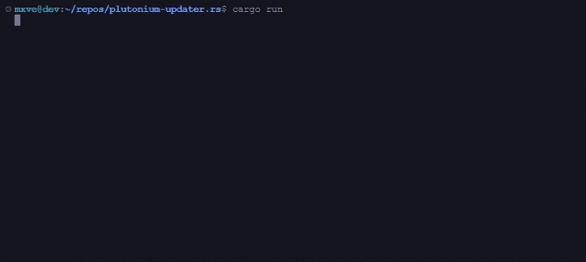

 [](https://github.com/mxve/plutonium-updater.rs/releases/latest) 

# Plutonium CLI Updater



### Download
- [Windows](https://github.com/mxve/plutonium-updater.rs/releases/latest/download/plutonium-updater-x86_64-pc-windows-msvc.zip)
- [Linux](https://github.com/mxve/plutonium-updater.rs/releases/latest/download/plutonium-updater-x86_64-unknown-linux-gnu.tar.gz)

### Quick Start
#### Windows
1. Download and unzip
2. Run `plutonium-updater.exe`

#### Linux/MacOS
```bash
# Extract
tar xfv plutonium-updater-*.tar.gz
# Make executable
chmod +x plutonium-updater
# Run
./plutonium-updater
```

### Example Scripts
#### Windows (update.bat)
```batch
@echo off
set installDir=C:\your_pluto_directory
plutonium-updater.exe -d "%installDir%"
```

#### Linux/MacOS (update.sh)
```bash
#!/bin/bash
INSTALLDIR=/home/pluto/pluto_dir
./plutonium-updater -d "$INSTALLDIR"
```

### Arguments
- ```-d, --directory <path>``` - Install directory (default: "plutonium")
- ```-f, --force``` - Force file hash check
- ```-l, --launcher``` - Download launcher assets
- ```-q, --quiet``` - Hide file actions
- ```-s, --silent``` - Hide all non-error output
- ```-c, --check``` - Check for updates (exit: 0=current, 1=outdated)
- ```--version-local``` - Print local version
- ```--version-cdn``` - Print latest version
- ```--no-color``` - Disable colors
- ```--backup``` - Create backup while updating
- ```--manual-backup``` - Create/update backup
- ```--backup-list``` - List backups
- ```--backup-restore <backup>``` - Restore backup
- ```--cdn-url``` - Override CDN URL
- ```-e, --exclude <path>``` - Exclude file/folder from update

### Building from Source
1. Install [Rust](https://rustup.rs/)
2. Clone repository
3. Build: ```cargo build --release```
4. Binary location: ```target/release/plutonium-updater(.exe)```

### Exit Codes
- 0: Success
- 1: Update available (with --check)
- 101: Error
